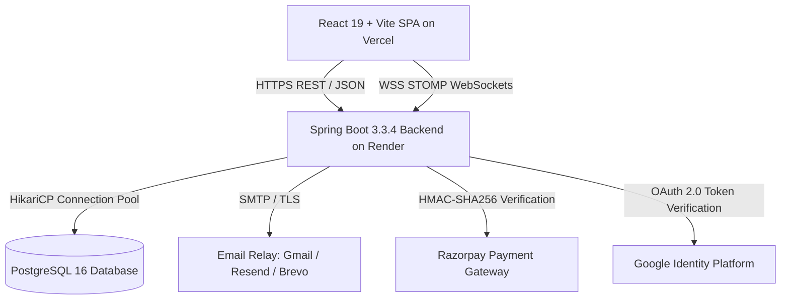
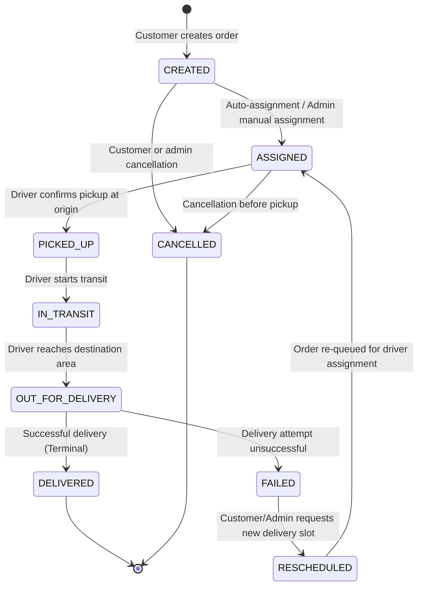
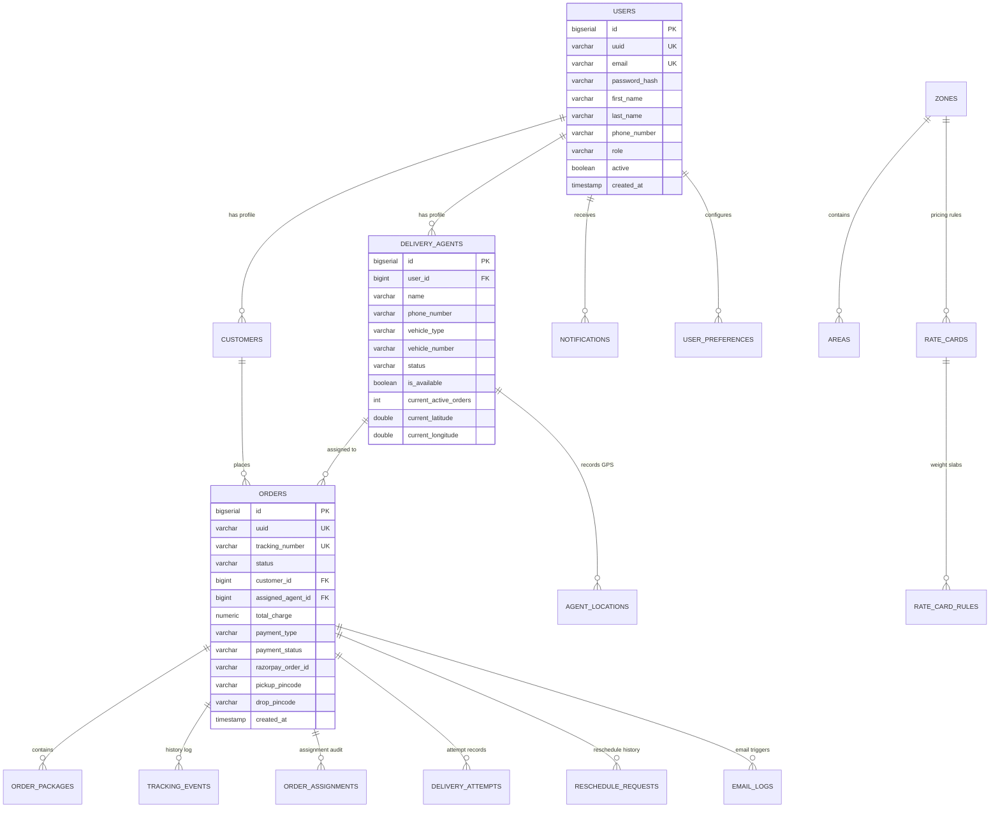

# GATIMAN — System Architecture & Technical Specifications

> **System Overview & Engineering Specification**  
> **Repository**: [Milindverma24/Last_mile_tracker_vitb](https://github.com/Milindverma24/Last_mile_tracker_vitb)  
> **Production Deployment**: [Frontend (Vercel)](https://frontend-ten-lyart-76.vercel.app) · [Backend API (Render)](https://last-mile-tracker-vitb.onrender.com) · [Swagger UI](https://last-mile-tracker-vitb.onrender.com/swagger-ui.html)

---

## 1. System Overview

GATIMAN is a full-stack last-mile logistics platform built to manage delivery workflows across urban corridors. It coordinates the lifecycle of shipments between three primary user roles:

1. **Customers**: Book shipments through a multi-step booking wizard, receive instant dynamic pricing based on physical parcel dimensions and delivery zones, track parcels with live GPS telemetry, and reschedule failed deliveries.
2. **Delivery Agents**: View active dispatch run sheets, execute status transitions (`PICKED_UP` → `IN_TRANSIT` → `OUT_FOR_DELIVERY` → `DELIVERED`/`FAILED`), log structured failure reasons, and manage on-duty availability.
3. **Operations Admins**: Fleet management, manual dispatch overrides, approval workflows for delivery rescheduling, zone/rate card configurations, and revenue and failure analytics.

---

## 2. High-Level Architecture

The system uses a clean client-server architecture with separation between presentation, security/routing, domain business logic, and persistence.



### Layered Structure

```
┌────────────────────────────────────────────────────────────────────────┐
│                        PRESENTATION TIER (SPA)                         │
│  React 19 • TypeScript • Tailwind CSS • TanStack Query • Lucide Icons │
│  • Customer Booking Wizard • Driver Run Sheet • Admin Mission Control  │
└───────────────────────────────────┬────────────────────────────────────┘
                                    │ HTTPS (REST) / WSS (STOMP)
┌───────────────────────────────────▼────────────────────────────────────┐
│                         API GATEWAY & SECURITY                         │
│  Spring Security 6 • JWT Stateless Auth (HMAC-SHA512) • CORS Filter    │
│  Role-Based Access Control (@PreAuthorize: CUSTOMER, DELIVERY_AGENT, ADMIN) │
└───────────────────────────────────┬────────────────────────────────────┘
                                    │
┌───────────────────────────────────▼────────────────────────────────────┐
│                          APPLICATION & DOMAIN                          │
│  Order Orchestrator • Status FSM • Dynamic Pricing Engine              │
│  Driver Allocation Algorithm • Live Telemetry Broker • Notification Hub│
└───────────────────────────────────┬────────────────────────────────────┘
                                    │ JPA / Hibernate 6 (HikariCP)
┌───────────────────────────────────▼────────────────────────────────────┐
│                           PERSISTENCE TIER                             │
│  PostgreSQL 16 (Render) • 18 Relational Entities • In-memory H2 (Dev)  │
└────────────────────────────────────────────────────────────────────────┘
```

---

## 3. Core Subsystems

### 3.1 Order Lifecycle & Finite State Machine (FSM)

Order status transitions are strictly validated in `OrderStatusTransitionServiceImpl` to prevent illegal status mutations or skipping steps:



#### Transition Invariant Matrix

| Current Status | Allowed Next Statuses | Action Trigger |
| :--- | :--- | :--- |
| `CREATED` | `ASSIGNED`, `CANCELLED` | Dispatch engine assigns driver, or order cancelled |
| `ASSIGNED` | `PICKED_UP`, `OUT_FOR_DELIVERY`, `CANCELLED` | Driver confirms package pickup |
| `PICKED_UP` | `IN_TRANSIT` | Driver begins transit route |
| `IN_TRANSIT` | `OUT_FOR_DELIVERY` | Driver approaches destination zone |
| `OUT_FOR_DELIVERY` | `DELIVERED`, `FAILED` | Successful handover or delivery failure recorded |
| `FAILED` | `RESCHEDULED` | Customer or operations admin selects new delivery slot |
| `RESCHEDULED` | `ASSIGNED` | Order approved and assigned to eligible driver |
| `DELIVERED` | *None (Terminal State)* | Order completed |
| `CANCELLED` | *None (Terminal State)* | Order cancelled |

---

### 3.2 Dynamic Pricing Engine

Delivery pricing is computed in `PricingServiceImpl` through four dedicated services (`VolumetricWeightService`, `ZoneDetectionService`, `RateCardRuleService`, `CodPricingService`).

1. **Volumetric Weight Calculation**:
   $$\text{Volumetric Weight (kg)} = \frac{\text{Length (cm)} \times \text{Breadth (cm)} \times \text{Height (cm)}}{5000}$$
   $$\text{Billable Weight} = \max(\text{Actual Weight}, \text{Volumetric Weight})$$

2. **Route Type Classification**:
   - Pickup Zone == Drop Zone $\implies$ `INTRA_ZONE`
   - Different Zones, Same State $\implies$ `INTER_ZONE`
   - Different States $\implies$ `INTER_STATE`

3. **Weight Slab Resolution**:
   The active `RateCard` is matched by `CustomerType` (B2C / B2B) and `RouteType`. The system identifies the rule where $\text{minWeight} \le \text{billableWeight} \le \text{maxWeight}$.
   $$\text{Base Charge} = \text{Slab Base Price} + \left(\lceil\text{Billable Weight} - \text{Slab Min}\rceil \times \text{Per-Kg Rate}\right)$$

4. **Cash on Delivery (COD) Surcharge**:
   If payment mode is `COD`, a surcharge is computed as:
   $$\text{COD Fee} = \text{Flat Surcharge} + \frac{\text{Percentage Surcharge} \times \text{Base Charge}}{100}$$
   $$\text{Total Charge} = \text{Base Charge} + \text{COD Fee}$$

---

### 3.3 Driver Dispatch & Auto-Assignment

Driver pairing (`AgentAssignmentServiceImpl`) executes in two distinct phases:

#### Phase 1: Hard Eligibility Filtering (`AgentEligibilityServiceImpl`)
A delivery agent must satisfy:
- `active == true` AND `isAvailable == true`
- $\text{currentActiveOrders} < \text{maxActiveOrders}$ (default concurrency limit = 5)
- Vehicle capacity must support package weight and maximum physical dimension:

| Vehicle Type | Max Weight | Max Dimension | Target Deliveries |
| :--- | :--- | :--- | :--- |
| `BIKE` | 5.0 kg | 40.0 cm | Small parcels, envelopes, documents |
| `EV_SCOOTER` | 5.0 kg | 40.0 cm | Eco-friendly lightweight urban parcels |
| `CAR` | 25.0 kg | 80.0 cm | Medium boxes, multi-item parcels |
| `VAN` | 25.0 kg | 100.0 cm | Bulk parcels, oversized boxes |
| `TEMPO` | 150.0 kg | 200.0 cm | Commercial freight, heavy furniture |
| `TRUCK` | 500.0 kg | 400.0 cm | Industrial cargo & palletized goods |

#### Phase 2: Proximity Scoring
Candidate agents are ranked using composite scoring (lower score is preferred):
$$\text{Score}(A) = \text{HaversineDist}(A_{\text{coords}}, \text{Origin}_{\text{coords}}) + (\text{ActiveOrders} \times 2.0) - \text{ZoneBonus} + \text{TieBreaker}$$
- **Haversine Distance**: Great-circle distance between driver GPS coordinates and the pickup centroid.
- **Workload Penalty**: `ActiveOrders * 2.0` distributes orders evenly across available drivers.
- **Zone Bonus**: $-10.0$ point discount if the agent is assigned to the pickup zone.
- **Tie-Breaker**: `(agentId % 10) * 0.01` provides deterministic resolution.

Assignment executes within an atomic `@Transactional` boundary, incrementing driver load, transitioning the order to `ASSIGNED`, recording a `DeliveryAttempt`, and appending a `TrackingEvent`.

---

### 3.4 Real-Time WebSocket Telemetry

Driver coordinates and status changes are broadcasted using STOMP over WebSockets:
- **Connection Endpoint**: `/ws` (with SockJS fallback)
- **Subscribed Channels**:
  - `/topic/orders/{orderId}/tracking` — Real-time GPS location updates (latitude, longitude, speed, heading).
  - `/topic/orders/{orderId}/status` — Status transition notifications.
  - `/topic/orders` — Global dispatch feed for the Admin Cockpit.

---

### 3.5 Failed Delivery Recovery & Rescheduling

When a delivery attempt is unsuccessful:
1. **Failure Recording**: The driver submits a standardized `FailureReason` (`CUSTOMER_UNAVAILABLE`, `ADDRESS_NOT_FOUND`, `CUSTOMER_REFUSED`, `ACCESS_ISSUE`, `PHONE_UNREACHABLE`, `WRONG_ADDRESS`, `SECURITY_ACCESS_DENIED`, `WEATHER_DISRUPTION`, `OTHER`).
2. **Workload Recovery**: The driver's `currentActiveOrders` counter is decremented immediately.
3. **State Transition**: Order transitions from `OUT_FOR_DELIVERY` $\to$ `FAILED`.
4. **Customer Rescheduling**: The customer selects a new preferred date and time slot via the tracking portal, creating a `RescheduleRequest` with status `PENDING`.
5. **Admin Review & Re-Dispatch**: Operations admin reviews and approves the request. The order transitions `FAILED` $\to$ `RESCHEDULED` $\to$ `ASSIGNED`, re-entering the dispatch queue.

---

### 3.6 Payment Integration (Razorpay & COD)

- **Online Payments (Prepaid)**:
  1. Frontend requests order creation via `POST /api/payments/razorpay/create-order`.
  2. Backend generates a Razorpay Order ID and returns checkout parameters.
  3. Upon customer completion in the Razorpay checkout modal, the frontend submits `razorpay_payment_id`, `razorpay_order_id`, and `razorpay_signature`.
  4. Backend verifies authenticity using **HMAC-SHA256**:
     $$\text{HMAC\_SHA256}(\text{order\_id} + "|" + \text{payment\_id}, \text{secret})$$
  5. Upon successful signature verification, order payment status is set to `PAID`.
- **Cash on Delivery (COD)**:
  - Instant order creation with payment status `PENDING` and reconciliation on delivery handover.

---

## 4. Database Schema (18 JPA Entities)



---

## 5. Security Architecture

1. **Stateless Authentication**:
   - Access tokens generated using HMAC-SHA512 (`HS512`) with a 24-hour expiration.
   - Claims include `userId`, `uuid`, `role`, and `sub` (email).
2. **Password Protection**:
   - `BCryptPasswordEncoder` with a work factor of 12.
3. **Role-Based Authorization**:
   - Controller methods protected with `@PreAuthorize("hasRole('ADMIN')")`, `@PreAuthorize("hasAnyRole('DELIVERY_AGENT', 'ADMIN')")`, or `@PreAuthorize("hasRole('CUSTOMER')")`.
4. **CORS Security**:
   - Strict origin whitelisting (`localhost`, production Vercel domain, Render backend).

---

## 6. Frontend Architecture

- **Core**: React 19 + TypeScript.
- **Server State & Caching**: TanStack Query v5 with automatic query invalidation upon mutations.
- **Routing & Guards**: React Router 7 with role-based route protection (`ProtectedRoute`, `RoleRoute`).
- **Form Validation**: React Hook Form with Zod runtime schemas.
- **Map & Telemetry Rendering**: Leaflet for interactive courier tracking routes.
- **Analytics Visualization**: Recharts for administrative dashboards.

---

## 7. Cloud Deployment Topology

```
┌────────────────────────────────────────────────────────┐
│                   GITHUB REPOSITORY                    │
│      Milindverma24 / Last_mile_tracker_vitb (main)     │
└───────────────┬────────────────────────┬───────────────┘
                │ Webhook Push           │ Webhook Push
┌───────────────▼──────────────┐ ┌───────▼──────────────┐
│        RENDER CLUSTER        │ │     VERCEL EDGE      │
│  • gatiman-backend (Docker)  │ │  • Static React 19   │
│  • gatiman-db (PostgreSQL 16)│ │  • Global Edge CDN   │
│  • Port 8088                 │ │  • Instant Rollouts  │
└──────────────────────────────┘ └──────────────────────┘
```

### Key Environment Configuration

| Variable | Target | Purpose |
| :--- | :--- | :--- |
| `DATABASE_URL` | Backend | PostgreSQL JDBC connection URL |
| `JWT_SECRET` | Backend | HMAC-SHA512 secret for token signing |
| `EMAIL_ENABLED` | Backend | Milestone notification dispatch toggle |
| `RAZORPAY_KEY_ID` | Backend & Frontend | Razorpay public integration key |
| `RAZORPAY_KEY_SECRET` | Backend | Razorpay server secret for HMAC-SHA256 signature verification |
| `VITE_API_URL` | Frontend | Production REST API base endpoint |
| `VITE_WS_URL` | Frontend | Production STOMP WebSocket endpoint |

