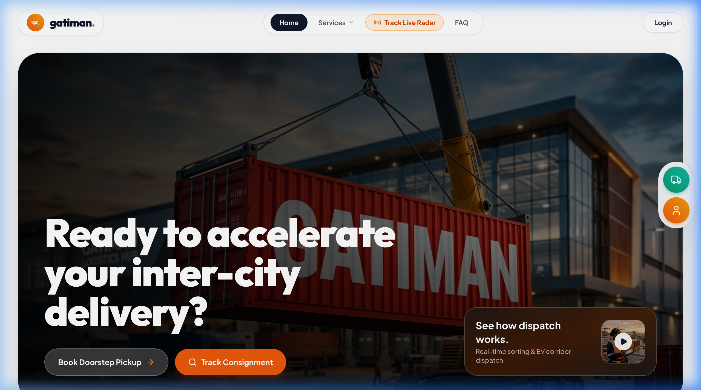
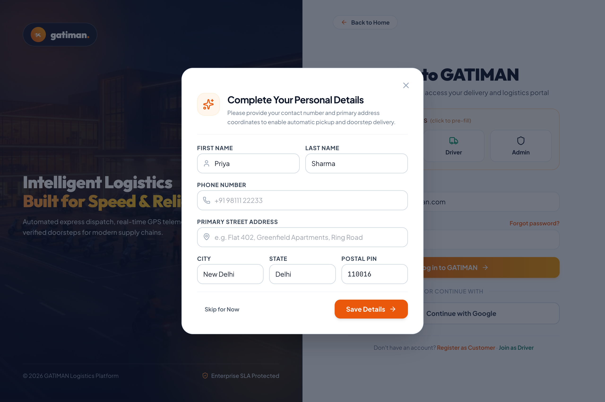
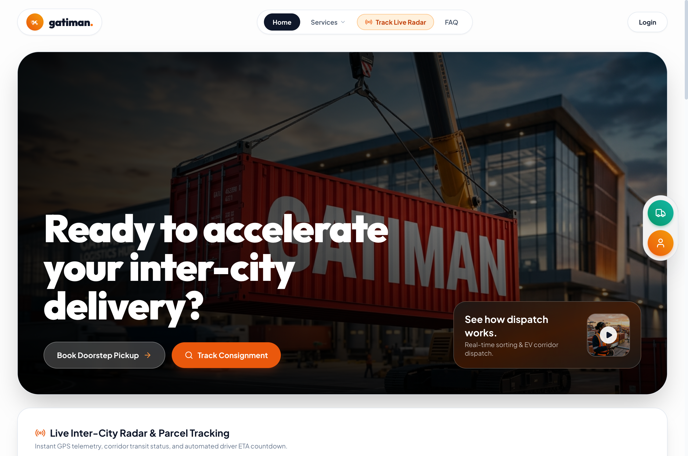
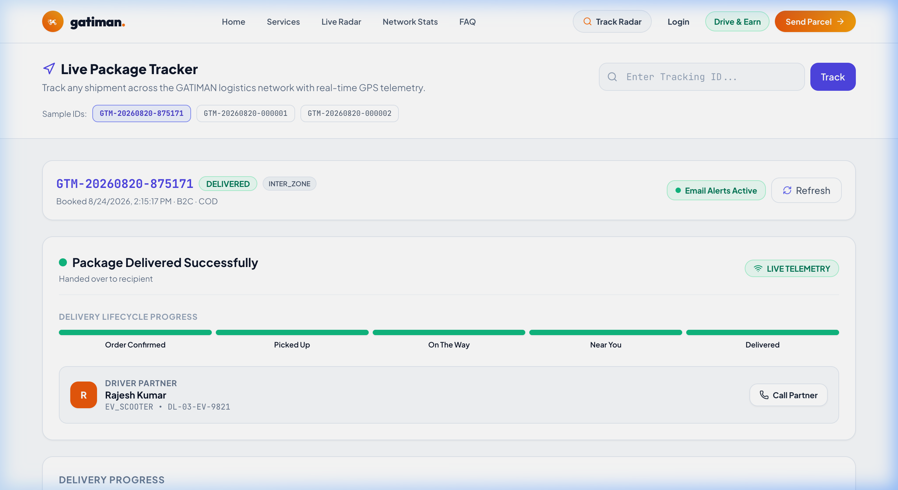
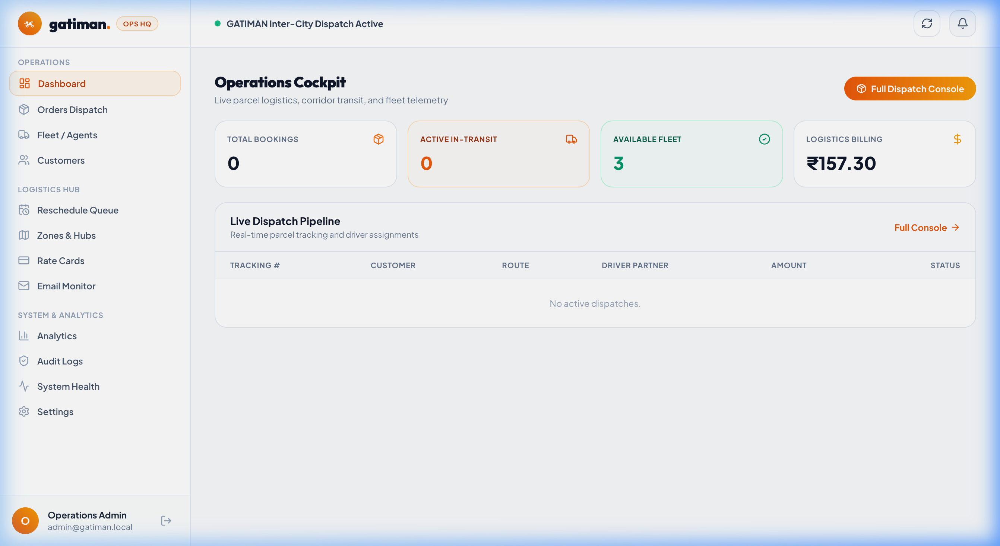
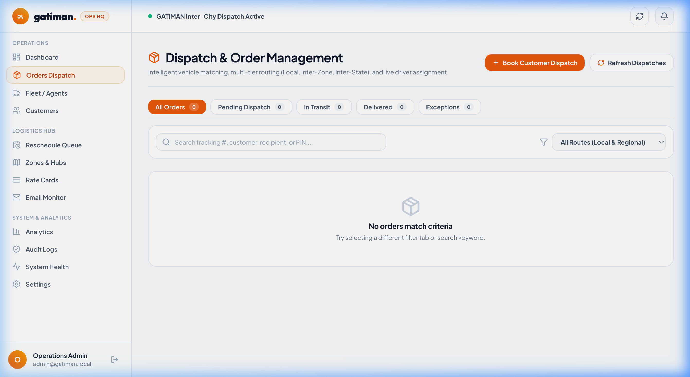

# GATIMAN — Last-Mile Delivery Management Platform

> **"गति से गंतव्य तक"** — Speed to Destination

[](https://spring.io/projects/spring-boot)
[](https://react.dev/)
[](https://www.postgresql.org/)
[](https://opensource.org/licenses/MIT)

**Live Demo**:
[Frontend (Vercel)](https://frontend-ten-lyart-76.vercel.app) ·
[Backend API (Render)](https://last-mile-tracker-vitb.onrender.com) ·
[Swagger Docs](https://last-mile-tracker-vitb.onrender.com/swagger-ui.html) ·
[GitHub](https://github.com/Milindverma24/Last_mile_tracker_vitb)

---

## What is GATIMAN?

GATIMAN manages the entire last-mile delivery workflow — from a customer placing a shipment order to the parcel arriving at their door, including everything that goes wrong in between.

The system handles three distinct user roles:
- **Customers** create delivery orders, see live pricing based on package dimensions, track shipments in real time, and reschedule failed deliveries.
- **Delivery Agents** receive assignments, update order status through each stage (pickup → transit → delivery), report failures with structured reasons, and toggle their availability.
- **Admins** monitor the fleet, manually assign/reassign drivers, approve reschedule requests, configure zones and rate cards, and view analytics.

It's built for urban delivery corridors (we use Delhi NCR as the reference model) but the zone and rate card system is fully configurable for any service area.

---

## Screenshots

### Landing Page


### Customer Dashboard


### Order Creation — Volumetric Rate Estimator


### Delivery Agent Dashboard


### Public Tracking Page


### Admin Operations Cockpit


### Admin Orders Dispatch Matrix


---

## Key Features

- **Dynamic Rate Calculation** — Volumetric weight formula `(L×B×H)/5000`, weight slab resolution, COD surcharges, B2C/B2B rate cards
- **Zone Detection** — PIN code → zone mapping with area-name fallback. Route classification: intra-zone, inter-zone, inter-state
- **Auto-Assignment** — Proximity-based scoring using Haversine distance, workload balancing, zone affinity, vehicle-weight matching
- **Order Status FSM** — Strict state machine: CREATED → ASSIGNED → PICKED_UP → IN_TRANSIT → OUT_FOR_DELIVERY → DELIVERED/FAILED
- **Failed Delivery Recovery** — Structured failure reasons, customer self-service rescheduling, admin approval workflow
- **Real-Time Tracking** — WebSocket STOMP for live GPS updates, append-only tracking event timeline
- **Razorpay Payments** — Online payment with HMAC-SHA256 verification, plus COD support
- **Google OAuth** — One-click sign-in alongside email/password registration
- **Email Notifications** — Milestone-triggered emails with idempotency checks (supports Gmail, Resend, Brevo)
- **Admin Analytics** — Order volume, revenue, zone performance, agent workload, failure analysis

---

## Architecture

```
┌──────────────────────────────────────────────────────────┐
│                    FRONTEND (SPA)                         │
│  React 19 · TypeScript · Tailwind CSS · TanStack Query   │
│  Deployed on Vercel                                      │
└─────────────────────┬────────────────────────────────────┘
                      │ HTTPS REST / WSS STOMP
┌─────────────────────▼────────────────────────────────────┐
│                 BACKEND (API Server)                      │
│  Spring Boot 3.3.4 · Spring Security · JPA/Hibernate     │
│  Port 8088 · Deployed on Render                          │
├──────────────────────────────────────────────────────────┤
│  Services: Pricing · Zone Detection · Agent Assignment   │
│  Order FSM · Tracking · Notifications · Email · Payment  │
└───────┬──────────┬──────────────┬────────────────────────┘
        │          │              │
   ┌────▼────┐ ┌───▼───┐  ┌──────▼──────┐
   │PostgreSQL│ │ SMTP  │  │  Razorpay   │
   │   16     │ │ Email │  │  Gateway    │
   └─────────┘ └───────┘  └─────────────┘
```

The frontend communicates with the backend via REST APIs and WebSocket connections. The backend handles all business logic and persists data to PostgreSQL. Email notifications go through SMTP (Gmail/Resend/Brevo). Payments are processed through Razorpay's API.

---

## Technology Stack

### Backend
| Technology | Purpose |
| :--- | :--- |
| Java 21 | Runtime |
| Spring Boot 3.3.4 | Web framework, DI, auto-configuration |
| Spring Security | JWT authentication, role-based access control |
| Spring Data JPA + Hibernate | ORM, database access |
| Spring WebSocket | STOMP-based real-time updates |
| Spring Mail | SMTP email dispatch |
| PostgreSQL 16 | Production database |
| H2 (PostgreSQL mode) | Zero-config local development database |
| JJWT 0.12.6 | JWT token generation and validation |
| SpringDoc OpenAPI 2.6.0 | Swagger UI / API documentation |
| Lombok | Boilerplate reduction |
| Commons Codec | HMAC computation for payment verification |

### Frontend
| Technology | Purpose |
| :--- | :--- |
| React 19 | UI library |
| TypeScript 6.x | Type safety |
| Vite 8 | Build tool and dev server |
| Tailwind CSS 3.4 | Utility-first styling |
| TanStack Query v5 | Server state management, caching |
| React Router 7 | Client-side routing with protected routes |
| React Hook Form + Zod | Form handling and schema validation |
| Axios | HTTP client |
| Recharts | Dashboard charts and analytics |
| Lucide React | Icon system |
| Leaflet | Map rendering for tracking |
| STOMP.js + SockJS | WebSocket client for live tracking |

### Deployment
| Platform | Component |
| :--- | :--- |
| Render | Backend API + PostgreSQL database |
| Vercel | Frontend SPA (edge CDN) |

---

## Project Structure

```
last_mile_delivery/
├── backend/
│   ├── pom.xml                          # Maven dependencies
│   ├── Dockerfile
│   └── src/main/java/com/gatiman/
│       ├── controller/                  # 12 REST controllers
│       ├── service/impl/                # Business logic (pricing, zones, assignment, orders)
│       ├── entity/                      # 18 JPA entities
│       ├── enums/                       # OrderStatus, Role, VehicleType, RouteType, etc.
│       ├── repository/                  # Spring Data JPA repositories
│       ├── security/                    # JWT filter, token provider, user details
│       ├── config/                      # Security, CORS, WebSocket, OpenAPI config
│       ├── exception/                   # Global exception handler
│       ├── dto/                         # Request/response DTOs
│       └── util/                        # SeedDataLoader (demo data on startup)
│
├── frontend/
│   ├── package.json
│   ├── Dockerfile / nginx.conf
│   └── src/
│       ├── api/                         # Axios client + API modules
│       ├── components/                  # Reusable UI components
│       ├── pages/
│       │   ├── customer/                # Dashboard, CreateOrder, Orders, Track, Reschedule
│       │   ├── agent/                   # Dashboard, Deliveries, History
│       │   └── admin/                   # Dashboard, Orders, Zones, RateCards, Agents, Analytics
│       ├── hooks/                       # TanStack Query hooks
│       ├── context/                     # AuthContext (JWT session)
│       ├── routes/                      # ProtectedRoute, RoleRoute
│       ├── schemas/                     # Zod validation schemas
│       └── types/                       # TypeScript interfaces
│
├── docs/screenshots/                    # 7 UI screenshots (embedded above)
├── docker-compose.yml                   # PostgreSQL + Backend + Frontend
├── .env.example                         # Template for environment variables
├── SYSTEM_DESIGN.md                     # System design write-up (~800 words)
├── DESIGN.md                            # Detailed technical design document
└── README.md
```

---

## Prerequisites

- **Java** 21+
- **Maven** 3.9+
- **Node.js** 20+ and **npm**
- **PostgreSQL** 16+ (optional — H2 in-memory is used by default)
- **Git**

---

## Local Setup

### 1. Clone the repository

```bash
git clone https://github.com/Milindverma24/Last_mile_tracker_vitb.git
cd Last_mile_tracker_vitb
```

### 2. Configure environment variables

```bash
cp .env.example .env
```

Edit `.env` with your own credentials. For basic local development, the defaults work — H2 in-memory database requires zero setup.

### 3. Start the backend (port 8088)

```bash
cd backend
mvn spring-boot:run
```

On first run, `SeedDataLoader` auto-provisions demo zones, rate cards, delivery agents, and sample users.

- API: http://localhost:8088/api
- Swagger UI: http://localhost:8088/swagger-ui/index.html
- H2 Console: http://localhost:8088/h2-console
- Health: http://localhost:8088/api/health

### 4. Start the frontend (port 5173)

```bash
cd frontend
npm install
npm run dev
```

Open http://localhost:5173 in your browser.

### 5. (Optional) Use PostgreSQL instead of H2

```bash
createdb gatiman_db
export DATABASE_URL=jdbc:postgresql://localhost:5432/gatiman_db
export DATABASE_USERNAME=postgres
export DATABASE_PASSWORD=postgres
export DATABASE_DRIVER=org.postgresql.Driver
```

Then restart the backend. Hibernate `ddl-auto: update` creates the schema automatically.

### 6. Docker Compose (everything at once)

```bash
docker-compose up --build
```

- Frontend: http://localhost:5174
- Backend: http://localhost:8088/api
- PostgreSQL: `localhost:5432` (database: `gatiman_db`)

---

## Environment Variables

| Variable | Required | Default | Description |
| :--- | :--- | :--- | :--- |
| `PORT` | No | `8088` | Backend server port |
| `DATABASE_URL` | No | H2 in-memory | JDBC connection string |
| `DATABASE_USERNAME` | No | `sa` | DB username |
| `DATABASE_PASSWORD` | No | *(empty)* | DB password |
| `JWT_SECRET` | No | Dev default | HMAC-SHA512 signing key for JWT tokens |
| `EMAIL_ENABLED` | No | `true` | Enable/disable email notifications |
| `EMAIL_HOST` | No | `smtp.gmail.com` | SMTP server host |
| `EMAIL_PORT` | No | `465` | SMTP port |
| `EMAIL_USERNAME` | No | *(empty)* | SMTP username |
| `EMAIL_PASSWORD` | No | *(empty)* | SMTP password / app password |
| `EMAIL_FROM` | No | `onboarding@resend.dev` | Sender email address |
| `RAZORPAY_KEY_ID` | No | Test key | Razorpay API key |
| `RAZORPAY_KEY_SECRET` | No | Test secret | Razorpay secret key |
| `CORS_ALLOWED_ORIGINS` | No | localhost + Vercel | Comma-separated allowed origins |
| `VITE_API_URL` | No | `http://localhost:8088/api` | Frontend → Backend API URL |
| `VITE_WS_URL` | No | `ws://localhost:8088/ws` | Frontend → WebSocket URL |
| `VITE_GOOGLE_CLIENT_ID` | No | — | Google OAuth 2.0 Client ID |
| `VITE_RAZORPAY_KEY_ID` | No | Test key | Razorpay public key for frontend |

---

## Demo Credentials

All accounts are pre-seeded by `SeedDataLoader` on startup with the password: `password123`.

| Role | Email | Capabilities |
| :--- | :--- | :--- |
| **Admin** | `admin@gatiman.local` | Fleet management, dispatch, zones, rate cards, analytics |
| **Customer** | `customer@gatiman.local` | Order booking, tracking, rescheduling |
| **Delivery Agent** | `agent1@gatiman.local` | Status updates, pickup/delivery flow, availability toggle |
| **Delivery Agent #2** | `agent2@gatiman.local` | Secondary driver |

---

## API Reference

### Authentication
| Method | Endpoint | Description | Auth |
| :--- | :--- | :--- | :--- |
| POST | `/api/auth/register` | Register a new user | No |
| POST | `/api/auth/login` | Login, returns JWT | No |
| POST | `/api/auth/google` | Google OAuth sign-in | No |
| GET | `/api/auth/me` | Get current user | Yes |

### Orders
| Method | Endpoint | Description | Auth |
| :--- | :--- | :--- | :--- |
| POST | `/api/orders/calculate-charge` | Calculate delivery rate | Yes |
| POST | `/api/orders` | Create a new order | Yes |
| GET | `/api/orders` | List orders (filtered by role) | Yes |
| GET | `/api/orders/{id}` | Get order details | Yes |
| GET | `/api/orders/track/{trackingNumber}` | Public tracking by tracking number | No |
| GET | `/api/orders/{id}/tracking` | Full tracking event timeline | Yes |
| POST | `/api/orders/{id}/auto-assign` | Auto-assign a delivery agent | Yes (Admin) |
| POST | `/api/orders/{id}/assign` | Manual agent assignment | Yes (Admin) |
| PATCH | `/api/orders/{id}/status` | Update order status | Yes (Agent/Admin) |
| POST | `/api/orders/{id}/fail` | Mark delivery as failed | Yes (Agent) |
| POST | `/api/orders/{id}/reschedule` | Request delivery reschedule | Yes (Customer) |

### Payments
| Method | Endpoint | Description | Auth |
| :--- | :--- | :--- | :--- |
| POST | `/api/payments/razorpay/create-order` | Create Razorpay payment order | Yes |
| POST | `/api/payments/razorpay/verify` | Verify payment signature (HMAC-SHA256) | Yes |
| GET | `/api/payments/orders/{orderId}/status` | Get payment status | Yes |

### Agents
| Method | Endpoint | Description | Auth |
| :--- | :--- | :--- | :--- |
| GET | `/api/agents` | List all agents | Yes (Admin) |
| GET | `/api/agents/me` | Get current agent profile | Yes (Agent) |
| PATCH | `/api/agents/me/availability` | Toggle on/off duty | Yes (Agent) |
| PATCH | `/api/agents/me/location` | Update GPS location | Yes (Agent) |

### Zones & Rate Cards
| Method | Endpoint | Description | Auth |
| :--- | :--- | :--- | :--- |
| GET | `/api/zones` | List all zones | Yes |
| POST | `/api/zones` | Create zone | Yes (Admin) |
| PUT | `/api/zones/{id}` | Update zone | Yes (Admin) |
| POST | `/api/zones/{id}/areas` | Add areas to zone | Yes (Admin) |
| GET | `/api/rate-cards` | List rate cards | Yes |
| POST | `/api/rate-cards` | Create rate card | Yes (Admin) |
| PUT | `/api/rate-cards/{id}` | Update rate card | Yes (Admin) |

### Admin
| Method | Endpoint | Description | Auth |
| :--- | :--- | :--- | :--- |
| GET | `/api/admin/dashboard` | Dashboard stats | Yes (Admin) |
| GET | `/api/admin/analytics/orders` | Order analytics | Yes (Admin) |
| GET | `/api/admin/analytics/revenue` | Revenue analytics | Yes (Admin) |
| GET | `/api/admin/reschedule-requests` | Pending reschedule requests | Yes (Admin) |
| POST | `/api/admin/reschedule-requests/{id}/approve` | Approve reschedule | Yes (Admin) |
| POST | `/api/admin/orders/{orderId}/reassign` | Reassign driver | Yes (Admin) |

### Other
| Method | Endpoint | Description | Auth |
| :--- | :--- | :--- | :--- |
| GET | `/api/health` | Health check | No |
| GET | `/api/notifications` | User notifications | Yes |
| PATCH | `/api/notifications/{id}/read` | Mark as read | Yes |
| GET | `/api/profile` | Get profile | Yes |
| PATCH | `/api/profile` | Update profile | Yes |

Full interactive documentation: [Swagger UI](https://last-mile-tracker-vitb.onrender.com/swagger-ui.html)

---

## Authentication Flow

```
User submits email + password (or Google OAuth token)
         ↓
Backend validates credentials (BCrypt hash comparison)
         ↓
JWT token generated (HMAC-SHA512, 24h expiry)
Claims: userId, uuid, email, role
         ↓
Frontend stores token in memory (AuthContext)
         ↓
Every API request includes: Authorization: Bearer <token>
         ↓
JwtAuthenticationFilter validates token on each request
         ↓
@PreAuthorize annotations enforce role-based access
```

**Roles**: `CUSTOMER`, `DELIVERY_AGENT`, `ADMIN`

Passwords are hashed with BCrypt (work factor 12). JWT tokens expire after 24 hours.

---

## Database Schema

18 JPA entities mapped to PostgreSQL tables:

| Entity | Purpose | Key Fields |
| :--- | :--- | :--- |
| `User` | All user accounts | email, passwordHash, role, uuid |
| `Customer` | Customer profile (extends User) | user_id (FK), company name, type (B2C/B2B) |
| `DeliveryAgent` | Driver profile | user_id (FK), vehicleType, isAvailable, currentActiveOrders, lat/lng |
| `Order` | Delivery shipment | trackingNumber, status, customer_id, agent_id, totalCharge, paymentType |
| `OrderPackage` | Package dimensions | order_id (FK), lengthCm, breadthCm, heightCm, weightKg |
| `Zone` | Delivery zone | name, code, state, isActive |
| `Area` | PIN code within a zone | zone_id (FK), pincode, name |
| `RateCard` | Pricing configuration | customerType, routeType, codSurchargeFlat, codSurchargePercentage |
| `RateCardRule` | Weight slab within a rate card | rateCard_id (FK), minWeightKg, maxWeightKg, basePrice, perKgRateAboveMin |
| `OrderAssignment` | Assignment audit log | order_id, agent_id, assignmentType (AUTO/MANUAL/REASSIGN) |
| `DeliveryAttempt` | Each delivery attempt | order_id, agent_id, attemptNumber, status, failureReason |
| `TrackingEvent` | Immutable status history | order_id, fromStatus, toStatus, actorName, lat, lng, timestamp |
| `RescheduleRequest` | Customer reschedule request | order_id, requestedDate, preferredTimeSlot, status (PENDING/APPROVED/REJECTED) |
| `Notification` | In-app notifications | user_id, type, title, message, isRead |
| `EmailLog` | Email dispatch audit trail | order_id, recipientEmail, eventType, status, htmlContent |
| `AgentLocation` | GPS location history | agent_id, latitude, longitude, timestamp |
| `AuditLog` | System audit trail | actorEmail, action, entityType, entityId, details |
| `UserPreference` | Notification preferences | user_id, emailNotifications, pushNotifications |

### Key Relationships

```
User
 ├── 1:1 ── Customer
 ├── 1:1 ── DeliveryAgent
 ├── 1:N ── Notification
 └── 1:1 ── UserPreference

Customer ──1:N──> Order

Order
 ├── N:1 ── DeliveryAgent (assigned)
 ├── N:1 ── Zone (pickup/drop)
 ├── 1:N ── OrderPackage
 ├── 1:N ── TrackingEvent
 ├── 1:N ── OrderAssignment
 ├── 1:N ── DeliveryAttempt
 ├── 1:N ── RescheduleRequest
 └── 1:N ── EmailLog

Zone ──1:N──> Area
RateCard ──1:N──> RateCardRule
```

---

## Rate Calculation Logic

The pricing engine lives in `PricingServiceImpl` and delegates to four services.

### Inputs
- Package dimensions (length, breadth, height in cm)
- Actual weight (kg)
- Pickup PIN code and Drop PIN code
- Customer type (B2C or B2B)
- Payment type (PREPAID or COD)

### Calculation Flow

```
Package Dimensions + Weight
         ↓
Volumetric Weight = (L × B × H) / 5000
Billable Weight = max(Actual Weight, Volumetric Weight)
         ↓
Pickup PIN → Zone, Drop PIN → Zone
Route Type = INTRA_ZONE | INTER_ZONE | INTER_STATE
         ↓
Find RateCard by (CustomerType × RouteType)
         ↓
Find weight slab where min ≤ billableWeight ≤ max
         ↓
Base Charge = Slab Base Price + ⌈excess weight⌉ × Per-Kg Rate
         ↓
COD Surcharge = Flat Fee + (Percentage × Base Charge) / 100
         ↓
Total = Base Charge + COD Surcharge
```

Excess weight is ceiling-rounded to full kilograms. If the billable weight exceeds the highest defined slab, the top slab applies as a catchall. Rate cards are configurable through the admin panel — no code changes needed to adjust pricing.

---

## Zone Detection

Zone detection (`ZoneDetectionServiceImpl`) maps a 6-digit PIN code to a `Zone` entity.

1. **Exact PIN match**: looks up the `areas` table by pincode. Returns the zone with confidence 1.0.
2. **Area name fallback**: if no exact PIN match, does a substring search across zone names. Returns with confidence 0.85.
3. **Not found**: throws `ZONE_NOT_FOUND` with the unmatched PIN code.

**Route type determination** (used for rate card selection):
- Same zone ID → `INTRA_ZONE`
- Different zones, different state → `INTER_STATE`
- Otherwise → `INTER_ZONE`

We chose a database-driven approach over external geocoding APIs to avoid per-request latency and API costs.

---

## Auto-Assignment Logic

When an order needs a driver, `AgentAssignmentServiceImpl.autoAssign()` runs:

### Phase 1 — Eligibility Filter

```
All agents → filter by:
  ✓ active = true
  ✓ isAvailable = true
  ✓ currentActiveOrders < maxActiveOrders (default: 5)
  ✓ vehicleType can carry package weight + dimensions
```

Six vehicle tiers: Bike (5 kg), EV Scooter (5 kg), Car (25 kg), Van (25 kg), Tempo (150 kg), Truck (500 kg).

### Phase 2 — Proximity Scoring

```
Score = Haversine Distance (km)
      + (Active Orders × 2.0)     ← workload penalty
      − 10.0 if same zone          ← zone affinity bonus
      + (agentId % 10) × 0.01     ← deterministic tie-breaker
```

Lowest score wins. Assignment happens atomically in a `@Transactional` block — the agent's workload increments, the order transitions to `ASSIGNED`, a `DeliveryAttempt` and `TrackingEvent` are created.

If no eligible agent exists, the API returns `NO_AVAILABLE_AGENT` with the required vehicle type.

Admin can also manually assign or reassign agents via the dispatch panel.

---

## Failed Delivery Handling

The order FSM only allows `OUT_FOR_DELIVERY → FAILED`.

**When a driver reports a failure:**
1. They submit a structured `FailureReason`: `CUSTOMER_UNAVAILABLE`, `ADDRESS_NOT_FOUND`, `CUSTOMER_REFUSED`, `ACCESS_ISSUE`, `PHONE_UNREACHABLE`, `WRONG_ADDRESS`, `SECURITY_ACCESS_DENIED`, `WEATHER_DISRUPTION`, `OTHER`
2. The agent's active order count is decremented
3. An immutable `TrackingEvent` is logged with GPS coordinates
4. An in-app notification is sent to the customer

**Rescheduling flow:**
1. Customer selects a new date and time slot through the tracking portal
2. A `RescheduleRequest` is created in `PENDING` state
3. Admin reviews and approves (or rejects) the request
4. On approval: order transitions `FAILED → RESCHEDULED → ASSIGNED`, re-enters auto-assignment
5. A new `DeliveryAttempt` record tracks the retry independently

Safeguards: duplicate pending requests are blocked, past dates are rejected, only the order owner or admin can request rescheduling.

---

## Error Handling

The `GlobalExceptionHandler` provides consistent error responses:

| Exception | HTTP Status | When |
| :--- | :--- | :--- |
| `ResourceNotFoundException` | 404 | Order/agent/zone not found |
| `BusinessRuleException` | 400 | Invalid status transition, no rate card, zone not found |
| `InvalidStatusTransitionException` | 409 | Illegal FSM transition (e.g., DELIVERED → ASSIGNED) |
| `UnauthorizedException` | 401 | Invalid or expired JWT |
| `ForbiddenException` | 403 | Insufficient role permissions |
| `BadCredentialsException` | 401 | Wrong email/password |
| `MethodArgumentNotValidException` | 400 | Validation failures (Zod/Bean Validation) |
| `DataIntegrityViolationException` | 409 | Duplicate email, constraint violations |
| `Exception` (fallback) | 500 | Unexpected server errors |

All responses follow a consistent `ErrorResponse` DTO with error code, message, and timestamp.

---

## Testing

21 test files covering service-layer logic:

```bash
cd backend
mvn clean test
```

**64 tests passing** across:
- `AuthServiceTest`, `OrderServiceTest`, `PricingServiceTest`
- `ZoneDetectionServiceTest`, `ZoneServiceTest`
- `AgentAssignmentServiceTest`, `RateCardServiceTest`, `RateCardRuleServiceTest`
- `OrderStatusTransitionServiceTest`, `CodPricingServiceTest`, `VolumetricWeightServiceTest`
- `PaymentServiceTest`, `EmailServiceTest`, `EmailTemplateServiceTest`
- `TrackingServiceTest`, `NotificationServiceTest`, `ProfileServiceTest`
- `RescheduleServiceTest`, `AnalyticsServiceTest`, `LiveTrackingServiceTest`
- `OrderLifecycleIntegrationTest`

Frontend tests: not currently implemented. The frontend is tested manually.

---

## Troubleshooting

**Backend won't start**
- Check that port 8088 isn't already in use: `lsof -i :8088`
- If using PostgreSQL, verify the connection string and that the database exists

**Frontend can't reach backend**
- Ensure the backend is running on port 8088
- Check `VITE_API_URL` in `.env` points to `http://localhost:8088/api`

**Email not sending**
- On Render/cloud: outbound SMTP port 465 may be blocked by the hosting firewall. This is expected — emails fail gracefully and are logged in `email_logs`
- Locally: configure `EMAIL_USERNAME` and `EMAIL_PASSWORD` with a Gmail App Password

**H2 Console not accessible**
- Navigate to http://localhost:8088/h2-console
- JDBC URL: `jdbc:h2:mem:gatiman_db`
- Username: `sa`, Password: *(empty)*

**Razorpay payments failing**
- Ensure `RAZORPAY_KEY_ID` and `RAZORPAY_KEY_SECRET` are set. Test keys work for sandbox mode.

---

## Development Notes

| What | Where |
| :--- | :--- |
| Add a new API endpoint | `backend/src/main/java/com/gatiman/controller/` |
| Add business logic | `backend/src/main/java/com/gatiman/service/impl/` |
| Add a database entity | `backend/src/main/java/com/gatiman/entity/` |
| Add a new enum | `backend/src/main/java/com/gatiman/enums/` |
| Add a frontend page | `frontend/src/pages/{role}/` |
| Add a frontend API call | `frontend/src/api/` |
| Add a TanStack Query hook | `frontend/src/hooks/` |
| Modify auth/security | `backend/src/main/java/com/gatiman/security/` + `config/SecurityConfig` |
| Seed data | `backend/src/main/java/com/gatiman/util/SeedDataLoader.java` |
| App configuration | `backend/src/main/resources/application.yml` |

---

## Future Enhancements

These features are **not implemented** — they are realistic next steps:

- **Route optimization** — Multi-stop delivery route planning using graph algorithms
- **Predictive ETA** — ML-based delivery time estimation using historical data
- **Dynamic surge pricing** — Demand-based rate adjustments during peak hours
- **Automated RTO** — Return-to-origin after N failed delivery attempts
- **Push notifications** — Browser/mobile push via FCM alongside in-app notifications
- **Advanced analytics** — Delivery success rate trends, agent performance scoring
- **Multi-tenant support** — Serve multiple logistics companies from a single deployment

---

## License

MIT License — see [LICENSE](LICENSE) for details.

Copyright © 2026 [Milind Verma](https://github.com/Milindverma24). All rights reserved.
