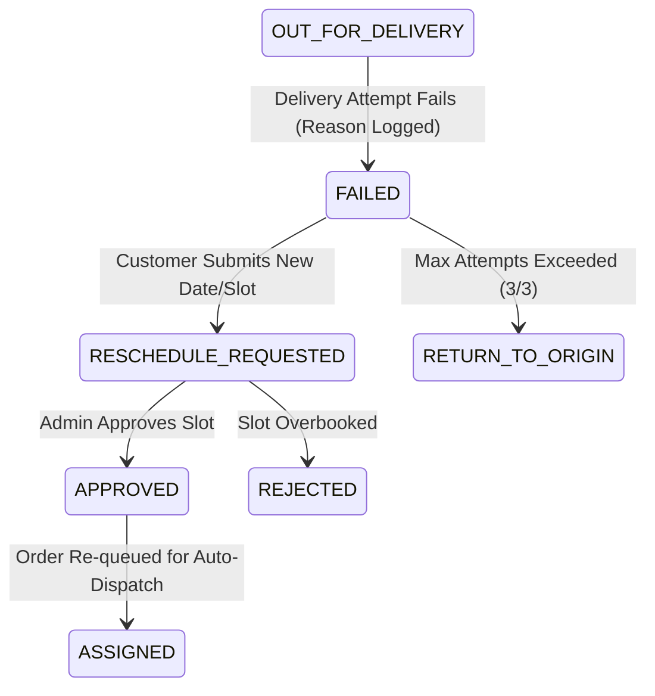

# GATIMAN Last-Mile Logistics — System Design

## 1. Rate Calculation Engine
GATIMAN utilizes a deterministic, multi-factor pricing engine (`PricingServiceImpl`) to calculate delivery charges dynamically based on physical dimensions, distance, customer classification, and payment mode.

1. **Volumetric vs. Actual Weight**:
   Industry standard volumetric divisor is applied:
   $$\text{Volumetric Weight (kg)} = \frac{\text{Length (cm)} \times \text{Breadth (cm)} \times \text{Height (cm)}}{5000}$$
   The billable weight is established as:
   $$\text{Billable Weight} = \max(\text{Actual Weight}, \text{Volumetric Weight})$$

2. **Rate Card Evaluation**:
   Rate rules are resolved hierarchically:
   $$\text{Base Charge} = \text{Base Price} + (\max(0, \text{Billable Weight} - \text{Base Weight Limit}) \times \text{Per Kg Surcharge})$$
   - Route classification applies: **Same Zone** (Intra-city), **Adjacent Zone**, or **Inter-City**.
   - Customer tiers apply: **B2C** (standard rate) vs. **B2B** (contractual volume discount).

3. **Ancillary Fees & Taxes**:
   - **COD Handling Fee**: Applied if `paymentType == COD` (min flat fee or tiered percentage of order value).
   - **Emergency/Express Surcharges**: Surge factor calculated on high-density traffic windows.
   - **Final Total**:
     $$\text{Total Charge} = \text{Base Charge} + \text{COD Fee} + \text{Fuel Surcharge}$$

---

## 2. Zone Detection Approach
Geographic routing and dispatch zones are managed through a dual-index spatial model (`ZoneDetectionServiceImpl`):

1. **Pincode Prefix & Exact Matching**:
   Each postal code (e.g., `110016` South Delhi, `122002` Gurugram Cyber City, `201301` Noida) is mapped to a specific `Zone` entity containing child `Area` records.
   - Initial lookup tests exact 6-digit Pincode matching.
   - Fallback lookup checks 3-digit regional sorting hub prefixes.

2. **Inter-Zone Matrix & Distance Traversal**:
   When pickup origin $P$ and drop destination $D$ are evaluated:
   - If $\text{Zone}(P) == \text{Zone}(D) \implies \text{RouteType.SAME\_ZONE}$
   - If $\text{Zone}(D) \in \text{AdjacentZones}(\text{Zone}(P)) \implies \text{RouteType.ADJACENT\_ZONE}$
   - Otherwise $\implies \text{RouteType.CROSS\_ZONE}$ (Long-haul express).

3. **Geodesic Distance Approximation**:
   Haversine formula computes point-to-point latitude/longitude distance:
   $$d = 2R \arcsin \left( \sqrt{\sin^2\left(\frac{\Delta \phi}{2}\right) + \cos(\phi_1)\cos(\phi_2)\sin^2\left(\frac{\Delta \lambda}{2}\right)} \right)$$
   Combined with urban road routing multipliers ($\approx 1.25 \times d_{\text{geodesic}}$) for real-time ETA calculation.

---

## 3. Auto-Assignment Logic
The dispatch engine (`AgentAssignmentServiceImpl`) optimizes delivery driver pairing using a deterministic scoring algorithm:

1. **Eligibility Filter**:
   Driver agents must satisfy hard constraints:
   - `isActive == true` AND `isAvailable == true`
   - $\text{CurrentActiveOrders} < \text{MaxActiveOrders}$ (default concurrency limit = 5)
   - Vehicle payload capability matches order weight (e.g., Bike for $<15\text{kg}$, EV Scooter for standard parcels, Van for bulk freight $>35\text{kg}$).

2. **Multi-Criteria Scoring Formula**:
   $$\text{Score}(A) = w_1 \cdot \text{Proximity}(A, \text{Origin}) + w_2 \cdot \text{WorkloadCapacity}(A) + w_3 \cdot \text{ZoneAffinity}(A)$$
   - **Proximity**: Inverted Haversine distance from driver's last reported GPS coordinate to pickup origin.
   - **Workload Balancing**: Lower active order counts receive higher priority to prevent driver burnout.
   - **Zone Affinity**: Bonus weight given if driver is currently inside the origin pickup zone.

3. **Atomic Lock & State Transition**:
   Selected agent is assigned atomically within a `@Transactional` block. The agent's `currentActiveOrders` is incremented, and order status transitions from `CREATED` $\to$ `ASSIGNED`.

---

## 4. Failed Delivery Handling & Rescheduling
Unsuccessful delivery attempts are governed by an automated recovery protocol (`RescheduleServiceImpl`):

1. **Failure Capture**:
   When a driver partner records an unsuccessful attempt, they must submit a standardized failure code (`CUSTOMER_UNAVAILABLE`, `INCORRECT_ADDRESS`, `CUSTOMER_REJECTED`, `PREMISES_CLOSED`).
   - Order transitions from `OUT_FOR_DELIVERY` $\to$ `FAILED`.
   - `attemptCount` increments. An automated transactional email notification is triggered.

2. **Self-Service Customer Rescheduling**:
   Customers can access the tracking portal to request a new delivery date and time window (e.g. `10:00 AM - 01:00 PM` or `02:00 PM - 06:00 PM`).
   - Creates a pending `RescheduleRequest` record.

3. **Re-Dispatch / Return to Origin (RTO)**:
   - If approved by operations admin, status transitions to `RESCHEDULE_APPROVED` $\to$ `ASSIGNED`, re-entering the auto-assignment queue.
   - If `attemptCount >= 3` without resolution, the order is marked `RETURN_TO_ORIGIN` (RTO) for reverse logistics to the sender.
